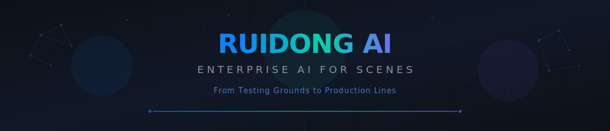
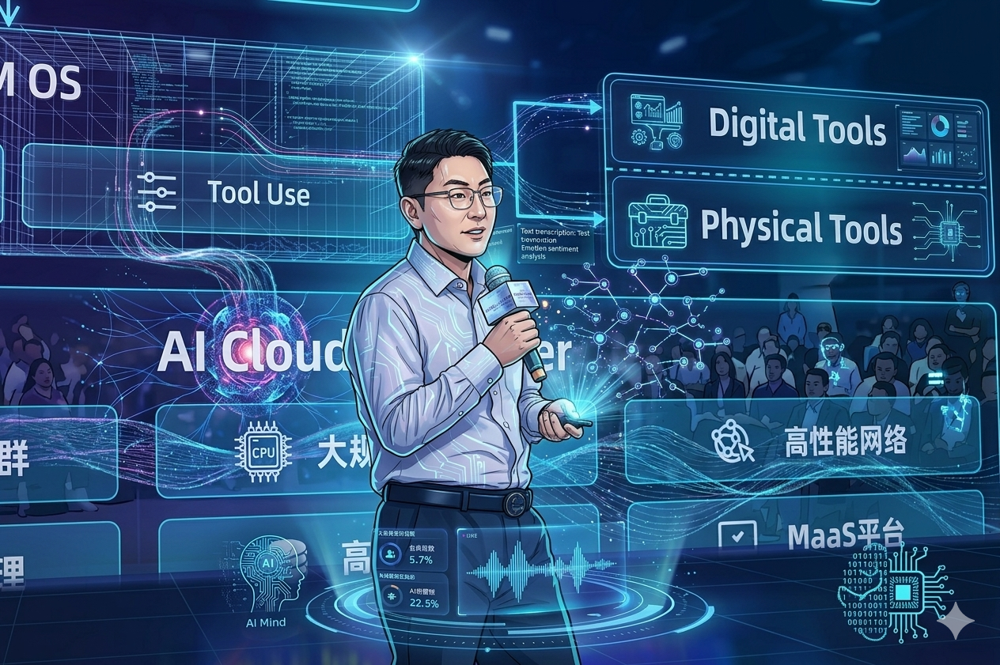
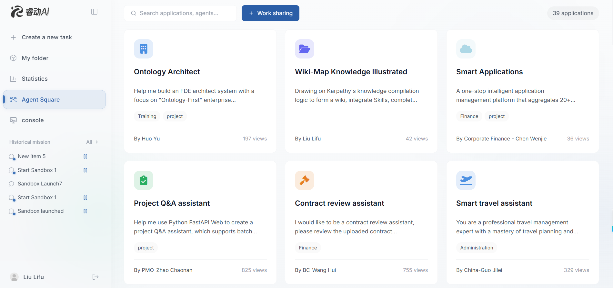
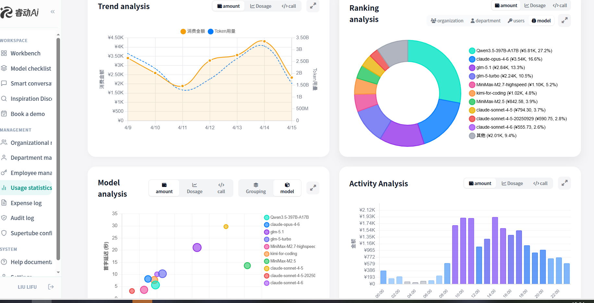
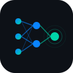

<div align="center">



<br/>

[](#-platform-architecture)
[](#-industry-scenarios)
[](#%EF%B8%8F-industrial-grade-security-foundation)
[](#-contact--联系我们)

<br/>



<br/>
<br/>

[Core Capabilities](#-core-capabilities) · [Industry Scenarios](#-industry-scenarios) · [Architecture](#-platform-architecture) · [Security](#%EF%B8%8F-industrial-grade-security-foundation) · [中文版](#-中文版)

</div>

<br/>


<br/>

## 🔭 Vision

> **From laboratory exploration in *AI for Science* to real-world productivity in *AI for Scenes*.**
>
> This is not merely a shift in technical focus — it marks the point where AI truly enters the **capillaries** of the enterprise.

The **Ruidong Agent Cloud Platform** is the core engine of this transformation — turning AI from an "expensive experiment" into a **manageable, controllable, and auditable** enterprise operating system.

<br/>

## 🎯 Core Capabilities

<table>
<tr>
<td width="50%" valign="top">

### 🏛️ Agent Square

Production-ready, industry-specific AI agents — deeply rooted in verticals, precisely positioned for execution.



</td>
<td width="50%" valign="top">

### 📊 AI Asset Auditing

Token-level billing and ROI analysis — the enterprise's **"Fifth Financial Report."**



</td>
</tr>
</table>

<br/>

<table>
<tr>
<td align="center" width="25%">
<br/>

<br/><br/>
<b>Scene-Driven</b>
<br/>
<sub>Frontline teams discover pain points first.<br/>Empower those who know the scene best.</sub>
<br/><br/>
</td>
<td align="center" width="25%">
<br/>

<br/><br/>
<b>Natural Language Dev</b>
<br/>
<sub>Business users build agents directly<br/>via natural language — zero coding.</sub>
<br/><br/>
</td>
<td align="center" width="25%">
<br/>

<br/><br/>
<b>MVP → Total Delivery</b>
<br/>
<sub>Breaking tech-business barriers.<br/>Prototype to production, streamlined.</sub>
<br/><br/>
</td>
<td align="center" width="25%">
<br/>

<br/><br/>
<b>Industrial Security</b>
<br/>
<sub>Micro-VM sandbox isolation.<br/>Physical-level data protection.</sub>
<br/><br/>
</td>
</tr>
</table>

<br/>

## 🏢 Industry Scenarios

<table>
<tr>
<th width="20%" align="center">Industry</th>
<th width="35%">Scene Agents</th>
<th width="45%">Core Value</th>
</tr>
<tr>
<td align="center"><b>🏦 Finance</b></td>
<td>Penetrating Regulatory Agent<br/>Due Diligence Assistant · Account Opening Assistant</td>
<td>Automated penetrating compliance auditing, reducing processing cycles from days to <b>minutes</b></td>
</tr>
<tr>
<td align="center"><b>⚡ Energy</b></td>
<td>Equipment Management Assistant<br/>Energy Knowledge Graph</td>
<td>Solidifying veteran expertise into <b>digital assets</b>, ensuring safe &amp; smart production lines</td>
</tr>
<tr>
<td align="center"><b>🏬 Corporate</b></td>
<td>Financial Audit Assistant<br/>Contract Review Assistant</td>
<td>Risk control verification in <b>seconds</b> — balancing rigor with efficiency</td>
</tr>
<tr>
<td align="center"><b>🌐 Cross-Industry</b></td>
<td>Custom agents via Intellectual Creation Workshop</td>
<td>Business users model with natural language, accelerating AI-native transformation</td>
</tr>
</table>

<br/>

## 🔧 Platform Architecture

```
┌─────────────────────────────────────────────────────────────────────────┐
│                     Ruidong Agent Cloud Platform                        │
├─────────────────────────────────────────────────────────────────────────┤
│                                                                         │
│   ┌──────────────┐  ┌──────────────┐  ┌──────────────┐                 │
│   │ Agent Square  │  │ Intellectual │  │   Ruidong    │                 │
│   │  (Marketplace)│  │  Creation    │  │   Claw       │                 │
│   │              │  │  Workshop    │  │   (Desktop)  │                 │
│   └──────┬───────┘  └──────┬───────┘  └──────┬───────┘                 │
│          │                 │                  │                          │
│   ┌──────▼─────────────────▼──────────────────▼───────┐                 │
│   │             Multi-Model Router                     │                 │
│   │    Qwen · Claude · GLM · Kimi · MiniMax · ...     │                 │
│   └────────────────────────┬──────────────────────────┘                 │
│                            │                                            │
│   ┌────────────────────────▼──────────────────────────┐                 │
│   │        Industrial-Grade Security Foundation        │                 │
│   │  Micro-VM Sandbox · Token Auditing · Edge-Cloud   │                 │
│   └───────────────────────────────────────────────────┘                 │
│                                                                         │
└─────────────────────────────────────────────────────────────────────────┘
```

<br/>

## 🛡️ Industrial-Grade Security Foundation

<table>
<tr>
<td width="33%" align="center">
<br/>
<h3>🔒 Physical-Level Isolation</h3>
<p>Micro-VM sandbox technology<br/>Every agent runs in an isolated environment<br/>Data <b>never leaves the internal network</b></p>
</td>
<td width="33%" align="center">
<br/>
<h3>📋 "The Fifth Report"</h3>
<p>Beyond the four traditional financial statements<br/><b>AI Asset Auditing</b> introduced<br/>Token-level billing &amp; ROI analysis</p>
</td>
<td width="33%" align="center">
<br/>
<h3>🖥️ Edge-Cloud Synergy</h3>
<p><b>Ruidong Claw</b> desktop client<br/>Cloud governance extended to the desktop<br/>IM · Docs · Native work scenarios</p>
</td>
</tr>
</table>

<br/>

## ✨ Why Ruidong

| Dimension | Traditional AI | Ruidong AI for Scenes |
|:---:|:---:|:---:|
| **Development** | Tech-team driven, long cycles | Business users build via NL, minutes to go live |
| **Security** | Data leakage risks | Micro-VM physical isolation, data stays on-prem |
| **Cost Control** | AI spend unquantifiable | Token-level billing, full ROI visibility |
| **Delivery** | POC-to-production gap | MVP → total delivery, streamlined path |
| **Model Flexibility** | Single model lock-in | Multi-model routing, optimal match per scene |
| **Org Enablement** | Few users | AI-native, organization-wide participation |

<br/>


<br/>

<div align="center">

## 🇨🇳 中文版

# 睿动 AI &mdash; 企业级 AI for Scenes

### 从"试炼场"到"流水线"，让 AI 在真实业务场景中生长

</div>

<br/>

## 🔭 愿景

> **从 "AI for Science" 的实验室探索，走向 "AI for Scenes" 的生产力实战。**
>
> 这不仅是技术重心的转移，更是 AI 真正进入企业"毛细血管"的标志。

**睿动智能体云平台**致力于成为这场变革的核心引擎——让 AI 不再是"昂贵的实验"，而是一套 **可管、可控、可审计** 的企业级操作系统。

<br/>

## 🎯 核心能力

<table>
<tr>
<td width="50%" valign="top">

### 🏛️ 智能体广场 · Agent Square

开箱即用的行业级 AI 智能体生态，深耕行业、精准卡位。


</td>
<td width="50%" valign="top">

### 📊 全量数据治理 · AI Asset Auditing

Token 级计费与 ROI 分析——企业的 **"第五张报表"**。


</td>
</tr>
</table>

<br/>

<table>
<tr>
<td align="center" width="25%">
<br/>

<br/><br/>
<b>场景驱动</b>
<br/>
<sub>发现场景痛点的永远是业务一线<br/>让最懂场景的人亲手"点石成金"</sub>
<br/><br/>
</td>
<td align="center" width="25%">
<br/>

<br/><br/>
<b>自然语言开发</b>
<br/>
<sub>业务人员在"智创工坊"中<br/>通过自然语言直接开发智能体</sub>
<br/><br/>
</td>
<td align="center" width="25%">
<br/>

<br/><br/>
<b>MVP → 全量交付</b>
<br/>
<sub>打破技术与业务壁垒<br/>从最小可行到全量上线的极简路径</sub>
<br/><br/>
</td>
<td align="center" width="25%">
<br/>

<br/><br/>
<b>工业级安全</b>
<br/>
<sub>微虚拟机沙箱隔离<br/>数据"不出内网"的物理级保障</sub>
<br/><br/>
</td>
</tr>
</table>

<br/>

## 🏢 行业场景

<table>
<tr>
<th width="20%" align="center">行业</th>
<th width="35%">场景智能体</th>
<th width="45%">核心价值</th>
</tr>
<tr>
<td align="center"><b>🏦 金融</b></td>
<td>穿透式监管智能体<br/>尽调助手 · 开户助手</td>
<td>穿透式合规审计自动化，将数天处理周期缩短至 <b>分钟级</b></td>
</tr>
<tr>
<td align="center"><b>⚡ 能源</b></td>
<td>设备管理助手<br/>能源知识图谱</td>
<td>将老师傅脑中经验固化为 <b>数字资产</b>，确保产线安全与智慧运行</td>
</tr>
<tr>
<td align="center"><b>🏬 企业职能</b></td>
<td>财务审核助手<br/>合同审核助手</td>
<td>实现 <b>秒级</b> 风控校验，严谨与高效间的完美平衡</td>
</tr>
<tr>
<td align="center"><b>🌐 千行百业</b></td>
<td>智创工坊自定义智能体</td>
<td>业务人员自然语言建模，AI-native 组织基因加速构建</td>
</tr>
</table>

<br/>

## 🔧 平台架构

```
┌─────────────────────────────────────────────────────────────────────────┐
│                         睿动智能体云平台                                  │
│                   Ruidong Agent Cloud Platform                          │
├─────────────────────────────────────────────────────────────────────────┤
│                                                                         │
│   ┌──────────────┐  ┌──────────────┐  ┌──────────────┐                 │
│   │  智能体广场    │  │   智创工坊    │  │   Ruidong    │                 │
│   │ Agent Square  │  │  Workshop    │  │  Claw 桌面端  │                 │
│   └──────┬───────┘  └──────┬───────┘  └──────┬───────┘                 │
│          │                 │                  │                          │
│   ┌──────▼─────────────────▼──────────────────▼───────┐                 │
│   │           多模型调度引擎 · Model Router              │                 │
│   │    Qwen · Claude · GLM · Kimi · MiniMax · ...     │                 │
│   └────────────────────────┬──────────────────────────┘                 │
│                            │                                            │
│   ┌────────────────────────▼──────────────────────────┐                 │
│   │             工业级安全底座                           │                 │
│   │   微虚拟机沙箱  ·  Token 级审计  ·  端云协同         │                 │
│   └───────────────────────────────────────────────────┘                 │
│                                                                         │
└─────────────────────────────────────────────────────────────────────────┘
```

<br/>

## 🛡️ 工业级安全底座

<table>
<tr>
<td width="33%" align="center">
<br/>
<h3>🔒 物理级安全试炼</h3>
<p>微虚拟机沙箱技术<br/>每个智能体在隔离环境中运行<br/>数据<b>"不出内网"</b></p>
</td>
<td width="33%" align="center">
<br/>
<h3>📋 "第五张报表"</h3>
<p>继资产负债表等四大报表后<br/>引入 <b>AI 资产审计</b><br/>Token 级计费与 ROI 量化分析</p>
</td>
<td width="33%" align="center">
<br/>
<h3>🖥️ 端云协同 · 最后 100 米</h3>
<p><b>Ruidong Claw</b> 桌面端<br/>云端治理能力直达员工桌面<br/>IM · 文档 · 原生工作场景</p>
</td>
</tr>
</table>

<br/>

## ✨ 为什么选择睿动

| 维度 | 传统 AI 方案 | 睿动 AI for Scenes |
|:---:|:---:|:---:|
| **开发模式** | 技术团队主导，周期长 | 业务人员自然语言建模，分钟级上线 |
| **安全保障** | 数据外泄风险 | 微虚拟机物理隔离，数据不出内网 |
| **成本管控** | AI 投入不可量化 | Token 级精确计费，ROI 全程可视 |
| **交付路径** | POC 到落地断层 | MVP → 全量交付极简路径 |
| **模型灵活性** | 单一模型绑定 | 多模型路由，按场景最优匹配 |
| **组织赋能** | 少数人使用 | AI-native 全员参与，组织基因进化 |

<br/>


<br/>

<div align="center">

## 📬 Contact / 联系我们

**Ruidong AI** &nbsp;·&nbsp; Cliff AI Lab

For more information or to request a demo, feel free to reach out.

如需了解更多信息或申请试用，欢迎联系我们。

<br/>

[](https://github.com/Cliff-AI-Lab)

<br/>

---

<sub>

*From AI for Science in the laboratory, to AI for Scenes in every business scenario.*

*每一个痛点都是创新的火种，每一次试炼都是全量交付的前奏。*

**Ruidong — Let AI grow in scenes, let value bloom in practice.**

**睿动，让 AI 在场景中生长，让价值在实战中绽放。**

</sub>

<br/>
<br/>

Copyright &copy; 2025 Cliff AI Lab. All rights reserved.

</div>
