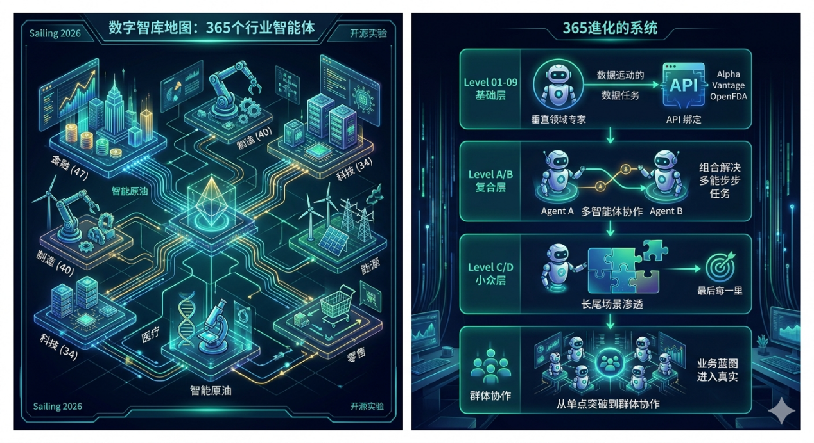
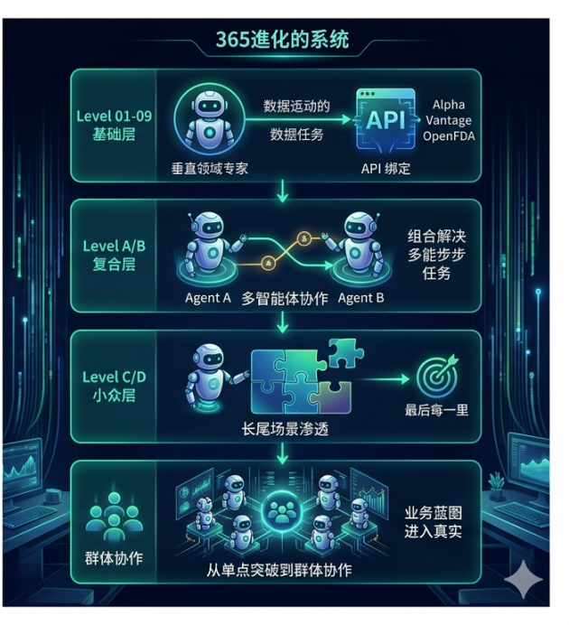

<div align="center">


<br/>
<br/>

# 🤖 Agent Square · General Collection

### **31 horizontal AI agents — your digital workforce, ready on day one.**

<br/>

[](#-catalog)
[](#-catalog)
[](#-quick-start)
[](#-file-format)

<br/>

**[🚀 Quick Start](#-quick-start)** · **[📚 Catalog](#-catalog)** · **[🧬 Evolution](#-the-365-evolution-system)** · **[📑 File Format](#-file-format)** · **[🇨🇳 中文版](#-中文版)**

</div>

---

## 💡 What is Agent Square?

> **One year. 365 agents. Every day a new digital employee.**

This repo holds the **general-purpose slice** — **31 horizontal agents** that act as digital employees inside any enterprise, regardless of industry: secretary, translator, designer, HR, contract manager, ESG reporter, global-expansion coach, knowledge-base steward, and more.

The **industry-specific slice (306 agents across 9 verticals)** lives in the companion repo **[Enterprise-AI-Lab/agent-square](https://github.com/Cliff-AI-Lab/Enterprise-AI-Lab/tree/main/agent-square)**. Together they form the **337-agent Agent Square**.

<table>
<tr>
<td width="33%" align="center">
<br/>
<h3>🎯</h3>
<b>Role + Capability + Data</b>
<br/>
<sub>Each agent = a clear role, a toolkit of APIs, and a deliverable surface</sub>
<br/><br/>
</td>
<td width="33%" align="center">
<br/>
<h3>🧩</h3>
<b>Plug & Play</b>
<br/>
<sub>Drop into Claude Code · paste into any LLM · use as a blueprint</sub>
<br/><br/>
</td>
<td width="33%" align="center">
<br/>
<h3>🌐</h3>
<b>Horizontal</b>
<br/>
<sub>Every company needs a secretary, a translator, an ESG report — these agents work everywhere</sub>
<br/><br/>
</td>
</tr>
</table>

<br/>

## 🧬 The 365 Evolution System

<div align="center">


</div>

<br/>

Agents evolve along four layers — from a single-capability specialist to an orchestrated business swarm. The prefix tells you exactly where on the evolution path an agent sits:

| Tier | Prefix | Role | This Collection |
|:---:|:---:|:---|:---:|
| 🤖 **Base** | `01–05` | Vertical-Domain Specialist · single capability + API binding | **5** |
| 🔗 **Composite** | `A01–A08` | Multi-Agent Collaboration · multi-API orchestration | **8** |
| 🎯 **Advanced** | `B01–B08` | Department-Level Platforms | **8** |
| 🌀 **Niche** | `C01–C04` | Sub-Domain Concierges | **4** |
| 🐝 **Long-Tail** | `D01–D06` | Specialized Back-Office Roles | **6** |
| | | **Total** | **31** |

<br/>

## 🚀 Quick Start

### 🎛️ Option 1 — Claude Code Subagent

```bash
cp "en/10-General/A01-Enterprise-AI-Secretary.md" ~/.claude/agents/secretary.md
```

### 💬 Option 2 — System Prompt (any LLM)

Copy any `.md` file's content and paste it as the **system prompt** in Claude / ChatGPT / Gemini / Qwen / Kimi / DeepSeek / GLM.

### 📦 Bundle Downloads

<div align="center">

[](agent-square-general-zh.zip)
&nbsp;
[](agent-square-general-en.zip)

</div>

<br/>

## 📚 Catalog

### 🤖 Base — Foundation Agents

| # | English | 中文 | Core Capability |
|:---:|:---|:---|:---|
| 01 | **Weather Forecaster** | 天气预报员 | Real-time + forecast weather intelligence |
| 02 | **News Aggregation Editor** | 新闻聚合编辑 | Multi-source news curation + digest |
| 03 | **Multilingual Translator** | 多语言翻译官 | Cross-lingual translation + tone preservation |
| 04 | **Document Generator** | 文档生成专家 | Structured document drafting |
| 05 | **Data Visualization Specialist** | 数据可视化师 | Chart generation from raw data |

### 🔗 Composite — A-series Applied Composites

| # | English | 中文 | Orchestration |
|:---:|:---|:---|:---|
| A01 | **Enterprise AI Secretary** | 企业智慧秘书 | Calendar · mail · meeting · follow-up |
| A02 | **Auto Meeting Minutes** | 会议纪要全自动 | ASR + summary + action items |
| A03 | **Competitive Intelligence Radar** | 竞争情报雷达 | Multi-source monitoring + analysis |
| A04 | **Bid & Tender Specialist** | 招投标专员 | Tender search + response drafting |
| A05 | **Contract Lifecycle Manager** | 合同全生命周期 | Draft · review · sign · archive |
| A06 | **ESG Report Auto-Generator** | ESG 报告一键生成 | Data collection + compliance reporting |
| A07 | **Enterprise Global Expansion** | 企业出海全链 | Market · legal · tax · localization |
| A08 | **Knowledge-Base RAG Steward** | 知识库 RAG 管家 | Ingest · chunk · retrieve · cite |

### 🎯 Advanced — B-series Department Platforms

| # | English | 中文 |
|:---:|:---|:---|
| B01 | Content Creation Studio | 内容创作工作室 |
| B02 | Brand Design System | 品牌设计系统 |
| B03 | HR-Tech Platform | HR 数字化平台 |
| B04 | Real-Estate Platform | 房产中介平台 |
| B05 | Travel Concierge | 旅游出游管家 |
| B06 | Subscription Management | 订阅制管家 |
| B07 | Open-Source Project Ops | 开源项目运营 |
| B08 | Video Conferencing Platform | 视频会议平台 |

### 🌀 Niche — C-series Sub-Domain

| # | English | 中文 |
|:---:|:---|:---|
| C01 | Corporate PR Crisis | 企业公关响应 |
| C02 | Enterprise Training Bot | 企业培训 Bot |
| C03 | Employee Benefits | 员工福利平台 |
| C04 | Corporate Gifting | 企业礼品采购 |

### 🐝 Long-Tail — D-series Back-Office Specialists

| # | English | 中文 |
|:---:|:---|:---|
| D01 | Admin Concierge | 企业行政管家 |
| D02 | Procurement Digital | 采购数字化 |
| D03 | Corporate Legal Advisor | 企业法律顾问 |
| D04 | Equity Compensation | 股权激励管家 |
| D05 | Business Intelligence Report | 企业数据报告 |
| D06 | Digital Collectibles Ops | 数字藏品运营 |

<br/>

## 📑 File Format

Every `.md` agent follows a **YAML frontmatter + structured body** layout:

```yaml
---
name: 中文名
name_en: English Name
type: 组合应用        # optional — marks A/B/C/D composites
industry: 所属行业
apis: [API list]
emoji: 🤖
---
```

**Body sections:**

1. 🎯 **Application Scenario** — what problem it solves
2. 🛠️ **Core Capabilities / Bound APIs** — what it can do + what it plugs into
3. 🔀 **Workflow** — step-by-step operation
4. 📦 **Typical Output** — deliverable samples

## 🗂️ Directory Structure

```
agent-square/
├── 🇨🇳 zh/10-通用/              (31 Chinese md files)
├── 🇺🇸 en/10-General/           (31 English md files)
├── 📦 agent-square-general-zh.zip
├── 📦 agent-square-general-en.zip
├── 🎨 assets/                    (hero + evolution banners)
└── 📖 README.md
```

<br/>

---

<br/>

<div align="center">

## 🇨🇳 中文版



<br/>
<br/>

# 🤖 Agent 广场 · 通用智能体集

### **31 个水平向 AI 智能体 —— 你的数字员工，开箱即用。**

</div>

<br/>

### 💡 这是什么？

> **一年 365 天，每天一个智能体，够你用一年。**

本仓库收录 **通用部分 —— 31 个水平向智能体**，不限行业、适用于任何企业的数字员工：秘书、翻译、设计师、HR、合同管家、ESG 报告员、出海顾问、知识库 RAG 管家……

**行业专属部分（9 大行业 306 个智能体）** 发布在姐妹仓库 **[Enterprise-AI-Lab/agent-square](https://github.com/Cliff-AI-Lab/Enterprise-AI-Lab/tree/main/agent-square)**。两仓合计 **337 个智能体**。

<table>
<tr>
<td width="33%" align="center">
<br/>
<h3>🎯</h3>
<b>角色 + 能力 + 数据</b>
<br/>
<sub>每个智能体 = 清晰的角色 + API 工具箱 + 可交付成果</sub>
<br/><br/>
</td>
<td width="33%" align="center">
<br/>
<h3>🧩</h3>
<b>即插即用</b>
<br/>
<sub>放进 Claude Code · 贴进任意大模型 · 当作业务蓝图</sub>
<br/><br/>
</td>
<td width="33%" align="center">
<br/>
<h3>🌐</h3>
<b>水平向</b>
<br/>
<sub>任何公司都需要秘书、翻译、ESG 报告 —— 跨行业通用</sub>
<br/><br/>
</td>
</tr>
</table>

<br/>

### 🧬 365 进化系统

<div align="center">



</div>

<br/>

智能体沿四层进化路径展开：从单一能力专家到跨角色业务群。前缀即进化阶位：

| 层级 | 前缀 | 定位 | 本集合 |
|:---:|:---:|:---|:---:|
| 🤖 **基础层** | `01–05` | 垂直领域专家 · 单一能力 + API 绑定 | **5** |
| 🔗 **复合层** | `A01–A08` | 多 Agent 协作 · 多 API 编排 | **8** |
| 🎯 **进阶层** | `B01–B08` | 部门级平台 | **8** |
| 🌀 **小众层** | `C01–C04` | 子领域管家 | **4** |
| 🐝 **长尾层** | `D01–D06` | 后台专员角色 | **6** |
| | | **合计** | **31** |

<br/>

### 🚀 两种用法

1. **🎛️ Claude Code 子代理**
   ```bash
   cp "zh/10-通用/A01-企业智慧秘书.md" ~/.claude/agents/secretary.md
   ```
2. **💬 系统提示词**：复制 md 内容贴到 Claude / ChatGPT / Gemini / Qwen / Kimi / DeepSeek / GLM 的系统提示词位置

### 📦 整包下载

<div align="center">

[](agent-square-general-zh.zip)
&nbsp;
[](agent-square-general-en.zip)

</div>

<br/>

### 📚 目录速查

<details>
<summary><b>🤖 基础层（5 个）</b> —— 单一能力 + API</summary>

天气预报员 · 新闻聚合编辑 · 多语言翻译官 · 文档生成专家 · 数据可视化师
</details>

<details>
<summary><b>🔗 复合层（8 个）</b> —— A 系列 · 多 Agent 编排</summary>

企业智慧秘书 · 会议纪要全自动 · 竞争情报雷达 · 招投标专员 · 合同全生命周期 · ESG 报告一键生成 · 企业出海全链 · 知识库 RAG 管家
</details>

<details>
<summary><b>🎯 进阶层（8 个）</b> —— B 系列 · 部门级平台</summary>

内容创作工作室 · 品牌设计系统 · HR 数字化平台 · 房产中介平台 · 旅游出游管家 · 订阅制管家 · 开源项目运营 · 视频会议平台
</details>

<details>
<summary><b>🌀 小众层（4 个）</b> —— C 系列 · 子领域管家</summary>

企业公关响应 · 企业培训 Bot · 员工福利平台 · 企业礼品采购
</details>

<details>
<summary><b>🐝 长尾层（6 个）</b> —— D 系列 · 后台专员</summary>

企业行政管家 · 采购数字化 · 企业法律顾问 · 股权激励管家 · 企业数据报告 · 数字藏品运营
</details>

<br/>

---

<br/>

<div align="center">

### 🌟 Explore More · 探索更多

<a href="https://iruidong.com/"></a>
&nbsp;
<a href="https://github.com/Cliff-AI-Lab/Ruidong-AI"></a>
&nbsp;
<a href="https://github.com/Cliff-AI-Lab/Enterprise-AI-Lab/tree/main/agent-square"></a>
&nbsp;
<a href="https://x.com/RaytoneAI"></a>

<br/>
<br/>

<sub>

*From laboratory exploration in AI for Science to real-world productivity in AI for Scenes.*

*一个智能体 = 一个可落地的业务锚点。一年 365 天，不重样。*

</sub>

<br/>

Copyright &copy; 2026 Cliff AI Lab. All rights reserved.

</div>
